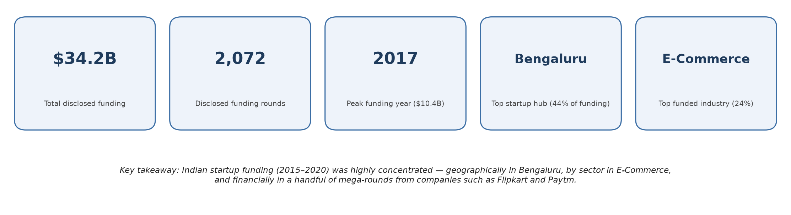
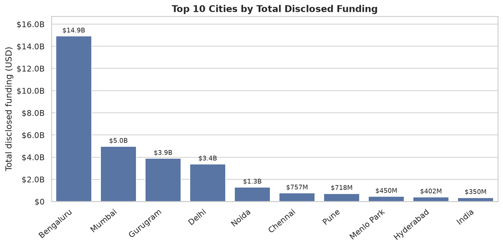
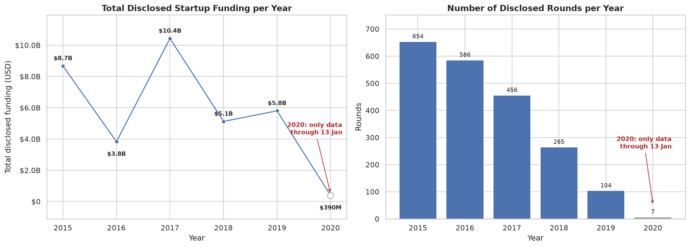
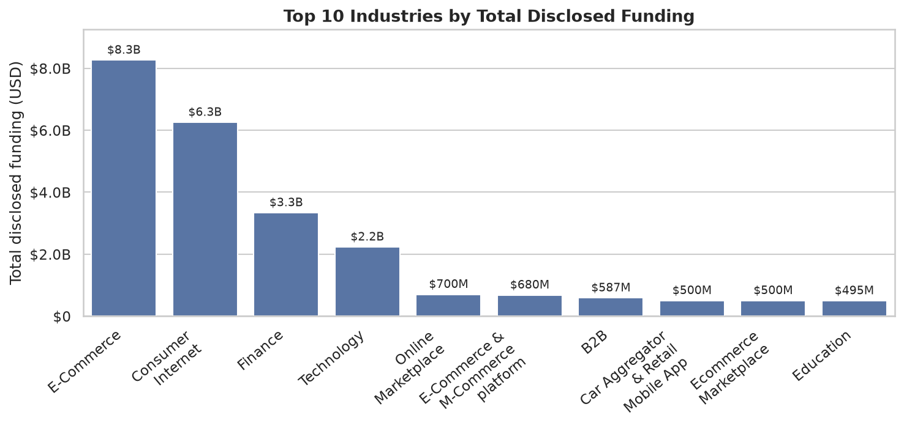
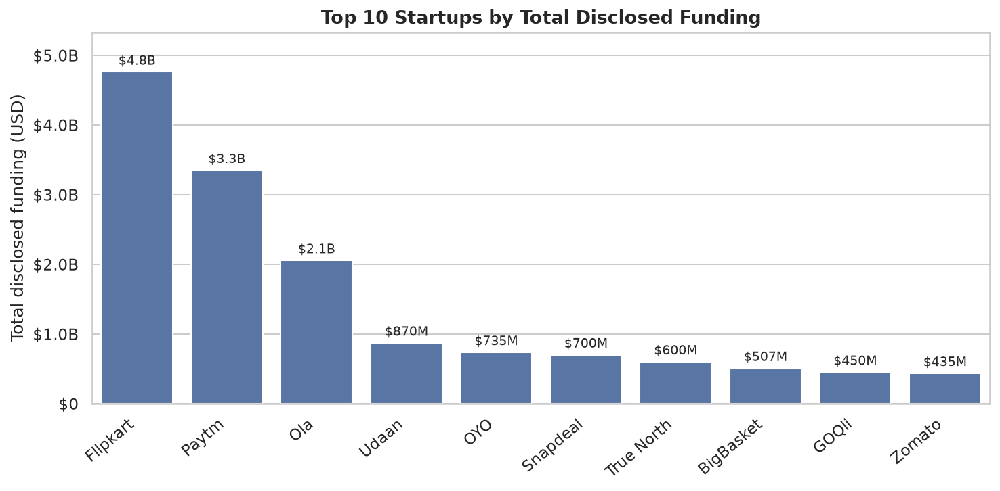

# Indian Startup Funding Analysis (2015–2020)

Exploratory data analysis of 2,072 disclosed Indian startup funding rounds from 2015–2020 (cleaned from 3,044 raw records): which cities, industries, stages, startups and investors attract the most capital, and how funding changed over time.

**Tools:** Python, pandas, matplotlib, seaborn, Jupyter



*All totals are **disclosed** funding only (rounds with a stated amount).*

## Key findings
- **Bengaluru dominates:** ~44% of all funding (~$14.9B) and 29% of rounds. Delhi-NCR (Delhi + Gurugram + Noida) is a clear second hub at ~25%.
- **Funding is highly concentrated:** the top 10 rounds are ~29% and the top 10 startups ~42% of all capital. Median round = $1.75M vs mean $16.5M.
- **E-Commerce draws the most capital (~24%)**; Consumer Internet and Technology have the most deals.
- **2017 was the peak year (~$10.4B)**, driven by Flipkart and Paytm. Deal count fell every year (654 → 104 from 2015 to 2019) while the median round grew from $1.5M to $12M.
- **Private Equity-labelled rounds hold ~80% of the money**; Seed/Angel is ~42% of deals but ~3% of capital.
- Most active investors: Accel Partners, Sequoia Capital (71 rounds each), Kalaari, SAIF Partners, Blume Ventures.

## Charts
| | |
|---|---|
|  |  |
|  |  |

All charts (including the executive summary) are in `images/`. The 2020 data covers only 13 days (through 13 Jan 2020) and is marked on the charts.

## Data cleaning highlights
- Removed hidden junk characters (`\xc2\xa0`, `\n`) that split identical labels
- Parsed `dd/mm/yyyy` dates correctly, including malformed ones (`12/05.2015`)
- Converted Indian-format amounts (`20,00,00,000`) to numbers; dropped undisclosed amounts (~31% of rows)
- Merged duplicate city / industry / investment-type / startup spellings (e.g. Bangalore + Bengaluru, Gurgaon + Gurugram, `ECommerce` + `eCommerce`)
- Excluded one likely data-entry outlier (Rapido, $3.9B)

## Limitations
Undisclosed amounts are excluded, round-type labels are inconsistent, 2020 has only 13 days of data, and values were not independently verified.

## Run it
```bash
pip install -r requirements.txt
jupyter notebook Indian_Startup_Funding_Analysis.ipynb
```
Data: `data/startup_funding.csv` (raw) → `data/cleaned_startup_funding.csv` (output).
